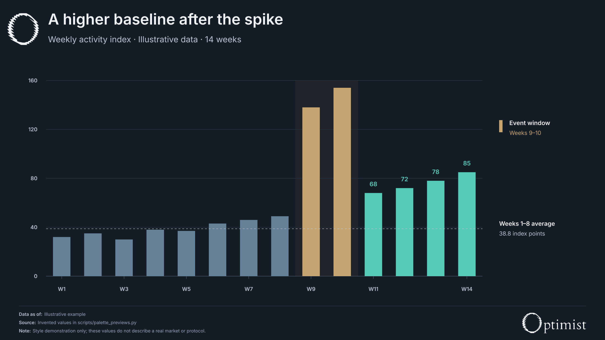
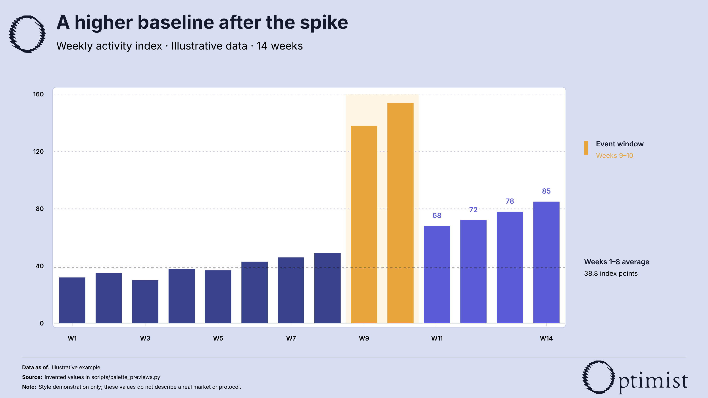
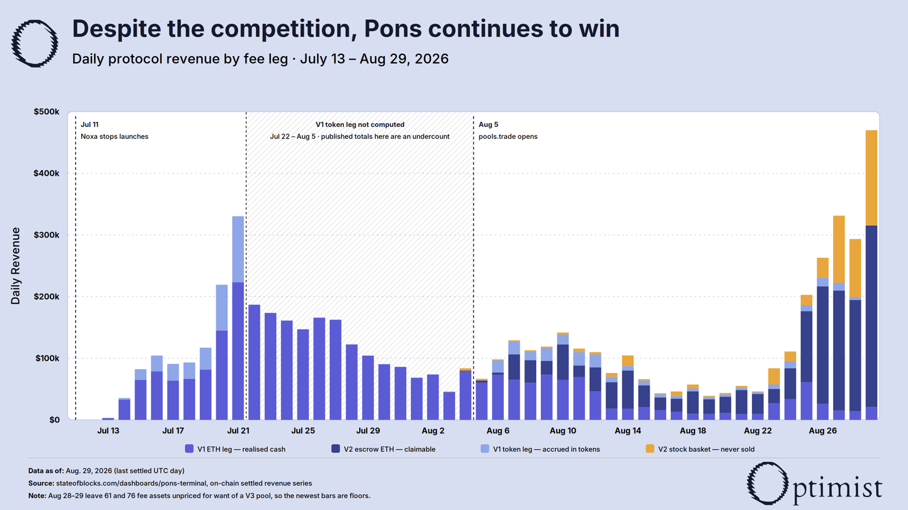
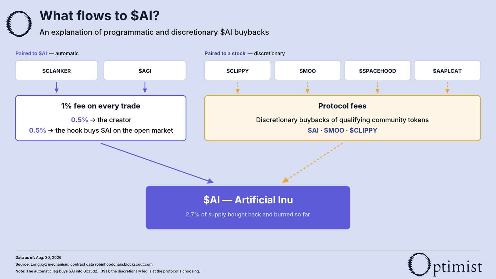
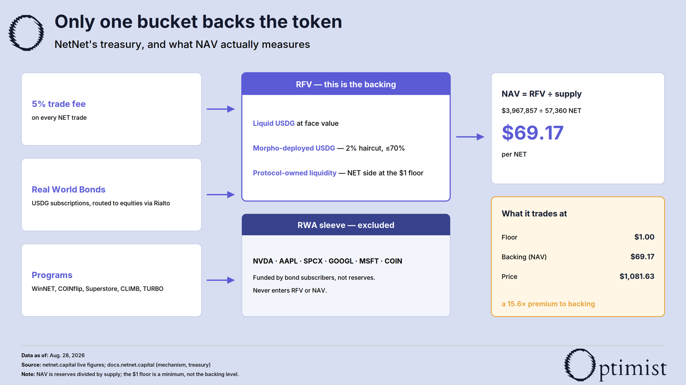

# Optimist figures

Create editable article charts and diagrams with Optimist marks, Inter typography,
measured layout checks, and two named palettes. Every figure ships as a **1600 × 900
SVG** and a matching **3200 × 1800 PNG**.

## Choose a palette

> Use Optimist figures skill with navy palette.

Navy uses a continuous slate canvas, muted steel for context, teal for focus, and sand
for exceptional periods. It includes the compact article typography and footer, with
the canonical Optimist O and aligned title/subtitle.

[](examples/palette-navy.svg)

> Use Optimist figures skill with white palette.

White is the familiar light Optimist treatment: **lavender canvas, white surfaces,
periwinkle and amber accents, black body text**. The name preserves that established
palette; it does not replace the canvas with pure white.

[](examples/palette-white.svg)

Both previews use the same invented values, solely to demonstrate styling.
Explicit palette requests take precedence. Edits keep the existing palette unless a
switch is requested. New figures default to white when no palette is specified.

## Install

Copy or clone this repository as an `optimist-figures` folder in your agent's skills
directory, keeping `SKILL.md`, `references/`, `assets/` and `scripts/` together. Point
an agent without a skill installer to [SKILL.md](SKILL.md). The renderer and licensed
Inter fonts are included; no toolkit generation step is needed.

Use the natural-language requests above, or invoke the installed skill by name with
your chart brief and a palette. Sources and calculations still need to be established
for each new data figure; the previews do not supply reusable research data.

## Renderer

From the repository or installed skill folder:

```sh
python3 -m venv .venv
.venv/bin/python -m pip install -r requirements.txt
.venv/bin/python scripts/palette_previews.py
.venv/bin/python scripts/test_palettes.py
.venv/bin/python scripts/okit.py
```

The last command intentionally detects an overflowing label to demonstrate that
clearance and containment are separate checks. Real figures must pass both checks,
then be inspected as rendered PNGs.

In a Python generator, add this skill's `scripts/` directory to the import path and use:

```python
from okit import Fig

f = Fig(palette="navy")  # or "white"; Fig() retains the standard white palette
C = f.colors
f.header("A title supported by the evidence", "Metric, units and time window")
f.text(127, 200, "A supporting label")
f.line(127, 230, 1550, 230)
# Draw measured data using C["historical"], C["focus"], C["exception"], etc.
f.footer("Retrieval date", "Source name and URL", "Material methodology or coverage limit.")
assert f.check() and f.check_containment()
f.save("figure.svg")
```

The palette sets the canvas, primitive defaults, title, subtitle, brand marks and footer.
For chart geometry and plot framing, follow the selected palette's reference.
Explicit colors passed to a primitive still override its defaults. Legacy light constants
and the `DARK_ARTICLE` import remain available for existing generators.

- [SKILL.md](SKILL.md): palette routing and figure workflow.
- [Brand specification](references/brand-spec.md): standard white palette, geometry and checks.
- [Navy specification](references/navy-palette.md): navy colors and article treatment.
- [Figure patterns](references/figure-patterns.md): chart and diagram recipes.
- [Palette JSON](assets/optimist-palettes.json) and [navy swatches](assets/optimist-navy-palette.svg).
- [Preview generator](scripts/palette_previews.py): reproduces both examples and the swatches.
- [Inter license](assets/fonts/LICENSE.txt): license for the bundled fonts.

## Earlier figures

These examples show other chart and diagram forms in the standard light palette.
Their historical data and wording are not a substitute for fresh sources.




